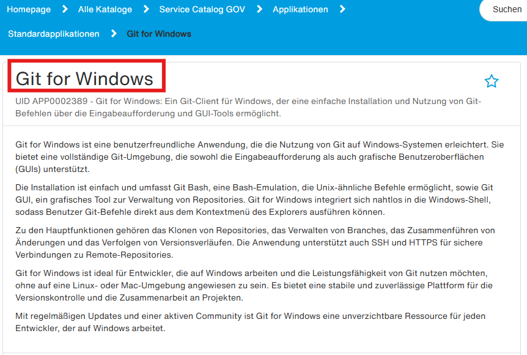
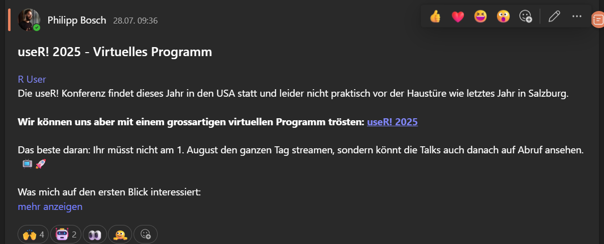

```{r}
#| include: false
library(countdown)
library(ggplot2)
library(ggthemes)
library(readr)
library(ggplot2)
library(gapminder)
library(dplyr)
library(epoxy)
library(palmerpenguins)

# Read variables from _variables.yml
vars <- yaml::read_yaml(here::here("_variables.yml"))

# Extract dates for this module
homework_due_date <- vars$`md-02`$`homework-due` |> as.Date()

# Set locale for German date formatting
Sys.setlocale("LC_TIME", "de_DE.UTF-8")

# Format dates for display
homework_due_formatted <- format(homework_due_date, "%A, %d. %B")
```

```{r}

gapminder_2007 <- gapminder |> 
  filter(year == 2007)

```

##  {background-image="img/md-02/r_rollercoaster.png" background-size="contain"}

::: aside
Artwork by [\@allison_horst](https://twitter.com/allison_horst)
:::

# Lösung von Coding Problemen {background-color="#4C326A"}

## Tipps für Suchmaschinen

-   Verwende Verben, die beschreiben, was du tun willst
-   Sei präzise
-   Füge R zur Suchanfrage hinzu
-   Füge den Namen des R-Pakets zur Suchanfrage hinzu (z.B ggplot2)
-   Scrolle durch die ersten 5 Ergebnisse (wähle nicht nur das erste aus)
-   Schreibe die Suchanfrage auf Englisch

**Beispiel: How to remove a legend from a plot in R ggplot2?**

## Stack Overflow

::: incremental
::: columns
::: {.column width="47.5%"}
**Was ist das?**

-   Das größte Unterstützungsnetzwerk für (Coding-)Probleme
-   Kann anfangs einschüchternd sein
-   Upvote-System
:::

::: {.column width="5%"}
:::

::: {.column width="47.5%"}
**Arbeitsablauf**

-   Lies dir zuerst kurz die Frage durch, die gepostet wurde.
-   Lies dir dann die Antwort durch, die als "richtig" markiert wurde.
-   Lies dir dann eine oder zwei weitere Antworten mit vielen Zustimmungen durch.
-   Sieh dir dann die "linked posts" an.
:::
:::
:::

## Tipps für AI Werkzeuge

-   Verwende Verben, die beschreiben, was du tun willst
-   Präzise sein ist weniger wichtig
-   Füge R zur Suchanfrage hinzu
-   Füge den Namen des R-Pakets zur Suchanfrage hinzu (z.B ggplot2)
-   Schreibe die Suchanfrage auf Englisch oder Deutsch

> Wie entferne ich eine Legende aus einem Diagramm in R ggplot2?  
> Legende in R ggplot2 entfernen.


## Andere Quellen für Hilfe

::: columns
::: {.column width="50%"}
-   Posit Community Forum: <https://community.rstudio.com/>
-   Dokumentation Webseiten: <https://ggplot2.tidyverse.org/>
-   Mastodon tag: [#rstats](https://fosstodon.org/tags/rstats)
:::

::: {.column width="50%"}

:::
:::

::: footer
Image generated with [DALL-E 3 by OpenAI](https://openai.com/blog/dall-e/)
:::

##  {background-image="img/md-02/code_hero.jpg" background-size="contain"}

::: footer
Artwork by [\@allison_horst](https://www.allisonhorst.com/)
:::

## Lernziele (für diese Woche)

```{r}
#| label: lernziele

lernziele <- readr::read_csv(here::here("data/tbl-01-rstatszh-lernziele.csv")) |> 
  dplyr::filter(modul == params$modul) |>
  dplyr::pull(lernziele)

```

```{epoxy}
{1:length(lernziele)}. {lernziele[1:length(lernziele)]}
```

# Digitaler Arbeitsplatz / R Community {background-color="#4C326A"}

## Triff das STAT

::: columns
::: {.column width="50%"}
**Philipp Bosch**

{fig-alt="" fig-align="center" width="33%"}

-   Job ohne Excel gesucht 🧮
-   Community Mensch 💙
-   Data Literacy Fan 💡
:::

::: {.column width="50%"}
**Thomas Knecht**

{fig-alt="" fig-align="center" width="50%"}

-   R-Support gegen Cookies 🍪
-   R-Infrastruktur Guru 🧙
-   Debug-Master & Kartentyp 🗺️
:::
:::

## Installation auf dem DAP

Um die komplette R-Toolbox auf dem DAP nutzen zu können, musst du im Serviceportal folgende Module bestellen:

::: columns
::: {.column width="30%"}
{width="80%"}
:::

::: {.column width="70%"}


Wichtige Hinweise wie ihr eure R-Installation auf dem DAP konfigurieren könnt, findet ihr auf [zHub](https://ktzuerich.sharepoint.com/sites/zh-informatik/SitePages/Datenanalyse-mit-R---R-Studio.aspx). Beachtet insbesondere die "Best practices". 
:::
:::

## Installation auf dem DAP (II)

Damit du auch auf dem DAP zwischen R & den Kursunterlagen auf Github kommunizieren kannst, brauchst du unbedingt noch Git auf deinem DAP. 
Auch hier löst du eine Bestellung im Serviceportal:

::: columns
::: {.column width="50%"}
{width="80%"}
:::

::: {.column width="50%"}
Sobald dir die Software zugewiesen wurde und alles auf dem DAP installiert ist, solltest du auch von deinem DAP R-Studio am Kurs teilnehmen können. 
:::
:::

## Community

Im Kanton haben wir eine Community of Practice für R, welche ihre digitale Heimat in einem Teams-Kanal hat.

[Hier geht's zum Kanal](https://teams.microsoft.com/l/channel/19%3Ab743f31273fb4d08b779263e12c27316%40thread.tacv2/R%20User?groupId=0ffbe0c2-40db-49df-8043-60dac2139834&tenantId=a020d0ae-094a-4d44-b66c-ac3fe8e90c58)

Im Kanal könnt ihr:

-   Fragen rund um R stellen (Stackoverflow des Kantons)
-   Neue Infos zum R-Bundle erhalten
-   Up-to-date bleiben was in der Community läuft

{width="80%" fig-align="center"}


## R-Fachgruppe {.scrollable}

::: columns
::: {.column width="50%"}
Aufgaben

-   Updates des R-Bundles
-   Weiterentwicklung der Installation anhand eurer Bedürfnisse
-   Support bei Installationsproblemen
:::

::: {.column width="50%"}
Vertretungen

-   Thomas Knecht (JI - STAT)

-   Philipp Bosch (JI - STAT)

-   Sarah Gerhard (BI)

-   Miriam Hofstetter (VD)

-   Andreas Gubler (BD)

-   Gianluca Macauda (GD)

-   Fabian Berger (SD)

-   Jörg Sintermann (BD)

-   Natalie Wrede (JI - JUWE)

-   Gian-Marco Alt (BD)

:::
:::

## Ihr seid dran: Fragen 

<br><br>

::: {.hand-purple-large style="text-align: center;"}
Stellt eure Fragen an Thomas und Philipp
:::


## Pause machen

[Bitte steh auf und beweg dich.]{.highlight-yellow}

{width="50%"}

```{r}
countdown(minutes = 10)
```

::: footer
Bild erzeugt mit [DALL-E 3 by OpenAI](https://openai.com/blog/dall-e/)
:::

# Explorative Datenanalyse mit `ggplot2` {background-color="#4C326A"}

## R Paket `ggplot2`

::: columns
::: {.column width="50%"}
-   **ggplot2** ist das Datenvisualisierungspaket von tidyverse
-   gg" in "ggplot2" steht für "Grammar of Graphics"
-   Inspiriert durch das Buch **Grammar of Graphics** von Leland Wilkinson
-   **Dokumentation:** https://ggplot2.tidyverse.org/
-   **Buch**: https://ggplot2-book.org
:::

::: {.column width="50%"}


```{r}
#knitr::include_graphics(here::here("slides/img/md-02/ggplot2-part-of-tidyverse.png"))
```
:::
:::

## Ich bin dran: Arbeiten mit Quarto und R

<br><br>

::: {.hand-purple-large style="text-align: center;"}
Zurücklehnen und genießen!
:::

## Code Struktur

-   `ggplot()` ist die Hauptfunktion von ggplot2
-   Plots werden in Schichten aufgebaut
-   Die Struktur des Codes für Plots lässt sich wie folgt zusammenfassen

```{r}
#| eval: false
#| echo: true

ggplot(data = [datensatz], 
       mapping = aes(x = [x-variable], 
                     y = [y-variable])) +
  geom_xxx() +
  andere Optionen 
```

## Code Struktur {auto-animate="true"}

```{r}
#| echo: true
#| fig-width: 7
#| fig-asp: 0.618
ggplot()
```

## Code Struktur {auto-animate="true"}

```{r}
#| echo: true
#| fig-width: 7
#| fig-asp: 0.618
ggplot(data = gapminder)
```

## Code Struktur {auto-animate="true"}

```{r}
#| echo: true
#| fig-width: 7
#| fig-asp: 0.618
ggplot(data = gapminder,
       mapping = aes()) 

```

## Code Struktur {auto-animate="true"}

```{r}
#| echo: true
#| fig-width: 7
#| fig-asp: 0.618
ggplot(data = gapminder,
       mapping = aes(x = continent,
                     y = lifeExp))  

```

## Code Struktur {auto-animate="true"}

```{r}
#| echo: true
#| fig-width: 7
#| fig-asp: 0.618
ggplot(data = gapminder,
       mapping = aes(x = continent,
                     y = lifeExp)) +
  geom_boxplot() 

```

## Code Struktur {auto-animate="true"}

```{r}
#| echo: true
#| fig-width: 7
#| fig-asp: 0.618
ggplot(data = gapminder,
       mapping = aes(x = continent,
                     y = lifeExp)) +
  geom_boxplot() +
  theme_minimal()

```

# Polls {background-color="#4C326A"}

## Poll 1: Was stellt die dicke Linie innerhalb des Kastens eines Boxplots dar? {.smaller}

::: columns
::: {.column width="30%"}
1.  Ich weiß es nicht
2.  der Mittelwert der Beobachtungen
3.  die Mitte der Box
4.  der Median der Beobachtungen
:::

::: {.column width="70%"}
```{r}
#| fig-width: 7
#| fig-asp: 0.618
ggplot(data = gapminder,
       mapping = aes(x = continent,
                     y = lifeExp)) +
  geom_boxplot() +
  theme_minimal(base_size = 14)
```
:::
:::

## Poll 2: Wie viel Prozent der Beobachtungen befinden sich innerhalb der Box eines Boxplots (Interquartilsbereich)? {.smaller}

::: columns
::: {.column width="30%"}
1.  Ich weiß es nicht
2.  25%
3.  hängt vom Median ab
4.  50%
:::

::: {.column width="70%"}
```{r}
#| fig-width: 7
#| fig-asp: 0.618
ggplot(data = gapminder,
       mapping = aes(x = continent,
                     y = lifeExp)) +
  geom_boxplot() +
  theme_minimal(base_size = 14)
```
:::
:::

## Poll 3: Was ist der Median einer Gruppe von Beobachtungen? {.smaller}

1.  Ich weiß es nicht
2.  Der Median ist der am häufigsten vorkommende Wert in einem Datensatz.
3.  Der Median ist die Summe aller Werte in einem Datensatz geteilt durch die Anzahl der Beobachtungen.
4.  Der Median ist der Punkt, über und unter dem die Hälfte (50%) der Beobachtungen liegt.

## Boxplot, erklärt

```{r}
#| label: fig-eda-boxplot
#| echo: false
#| fig-cap: |
#|   Diagramm, das zeigt, wie ein Boxplot erstellt wird.
#| fig-alt: |
#|   Ein Diagramm, das zeigt, wie ein Boxplot nach den oben beschriebenen 
#|   Schritten erstellt wird.

knitr::include_graphics("https://r4ds.hadley.nz/images/EDA-boxplot.png")
```

::: footer
Bild entnommen aus: <https://r4ds.hadley.nz/data-visualize#fig-eda-boxplot>
:::

::: notes
-   Die Box ist ein Feld, das den Bereich der mittleren Hälfte der Daten angibt, eine Distanz, die als Interquartilbereich (IQR) bekannt ist und sich vom 25. Perzentil der Verteilung bis zum 75. Perzentil erstreckt.

-   In der Mitte der Box befindet sich eine Linie, die den Median, d. h. das 50. Perzentil, der Verteilung anzeigt.

-   Diese drei Linien vermitteln einen Eindruck von der Streuung der Verteilung und davon, ob die Verteilung symmetrisch um den Median oder zu einer Seite hin verzerrt ist.

-   Visuelle Punkte, die Beobachtungen anzeigen, die mehr als das 1,5-Fache des IQR von einem der Ränder des Kastens entfernt liegen. Diese Ausreißer sind ungewöhnlich und werden daher einzeln dargestellt.

-   Eine Linie (oder ein Whisker), die sich von jedem Ende des Kastens bis zum am weitesten entfernten Punkt in der Verteilung erstreckt, der kein Ausreißer ist.
:::

## Wir sind dran: md-02-uebungen

::: task
1.  Öffne [posit.cloud](https://posit.cloud) in deinem Browser (verwende dein Lesezeichen).
2.  Öffne den  Arbeitsbereich (Workspace) für den Kurs.
3.  Klicke auf [Start]{.highlight-yellow} neben [md-02-uebungen]{.highlight-yellow}.
4.  Suche im Dateimanager im Fenster unten rechts die Datei [02-daten-visualisierung.qmd]{.highlight-yellow} und klicke darauf, um sie im Fenster oben links zu öffnen.
:::

```{r}
countdown(20)
```

## Pause machen

[Bitte steh auf und beweg dich.]{.highlight-yellow}

{width="50%"}

```{r}
countdown(minutes = 5)
```

::: footer
Bild erzeugt mit [DALL-E 3 by OpenAI](https://openai.com/blog/dall-e/)
:::

# Daten visualisieren {background-color="#4C326A"}

## Variablen Typen {.smaller}

::: incremental
::: columns
::: {.column width="50%"}
### Numerisch

**Diskrete Variablen**

-   nicht negative
-   zählbare
-   ganze Zahlen
-   z.B. Anzahl Schüler, Würfelwurf

**Stetige (kontinuierliche) Variablen**

-   unendliche Anzahl von Werten
-   zwischen zwei Werten
-   auch Datums/Uhrzeitwerte
-   z.B. Länge, Gewicht, Grösse
:::

::: {.column width="50%"}
### Nicht numerisch

**Kategoriale Variablen**

-   endliche Anzahl von Werten
-   eindeutige Gruppen (z.B. EU Länder)
-   **ordinal**, wenn diese eine logische Reihenfolge/Rangordnung aufweisen (z.B. Wochentage)
:::
:::
:::

## Histogramm

-   zur Visualisierung der Verteilung von kontinuierlichen (numerischen) Variablen

```{r}
#| label: histogram-penguins
#| fig-width: 6
#| fig-asp: 0.618
#| echo: true
#| code-line-numbers: "|3"
ggplot(data = penguins,
       mapping = aes(x = body_mass_g)) +
  geom_histogram()
```

## Barplot (Säulendiagramm)

-   zur Visualisierung der Verteilung von kategorischen (nicht numerischen) Variablen

```{r}
#| label: barplot-penguins
#| fig-width: 6
#| fig-asp: 0.618
#| echo: true
#| code-line-numbers: "|3"
ggplot(data = penguins,
       mapping = aes(x = species)) +
  geom_bar()
```

## Scatterplot (Streudiagramm) {.smallest}

-   for visualizing relationships between two continuous (numerical) variables

```{r}
#| label: scatterplot-gdp-lifeExp
#| fig-width: 6
#| fig-asp: 0.618
#| echo: true
#| code-line-numbers: "|6"
ggplot(data = gapminder_2007,
       mapping = aes(x = gdpPercap,
                     y = lifeExp,
                     size = pop,
                     color = continent)) +
  geom_point() +
  scale_color_colorblind() +
  theme_minimal()
```

# Zusatzaufgaben Modul 2 {background-color="#4C326A"}

## Modul 2 Dokumentation

::: learn-more
[/module/md-02.html](https:///module/md-02.html)
:::

## Zusatzaufgaben Abgabedatum

-   Abgabedatum: [`r homework_due_formatted`]{.highlight-yellow}

# Danke {background-color="#4C326A"}

## Danke! 

Folien erstellt mit revealjs und Quarto: https://quarto.org/docs/presentations/revealjs/ Folien als [PDF auf GitHub](website/raw/main/folien/md-02-datenvisualisierung.pdf)

Alle Materialien sind lizenziert unter [Creative Commons Attribution Share Alike 4.0 International](https://creativecommons.org/licenses/by-sa/4.0/).
