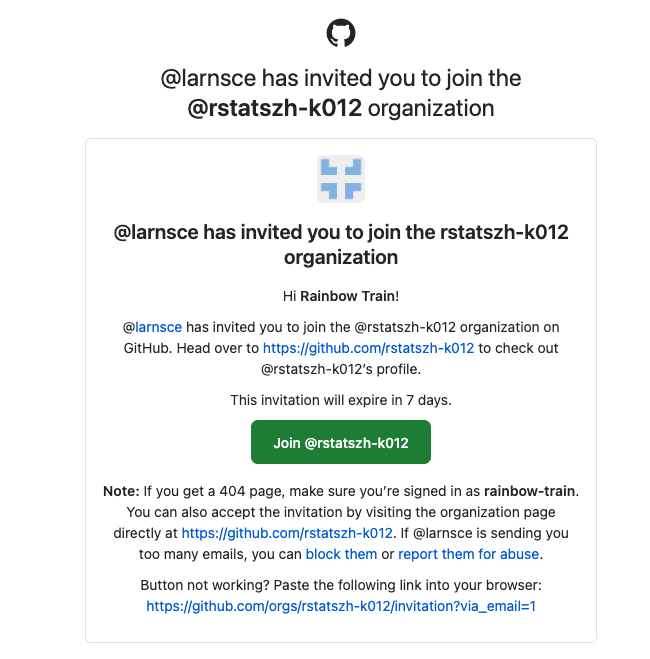
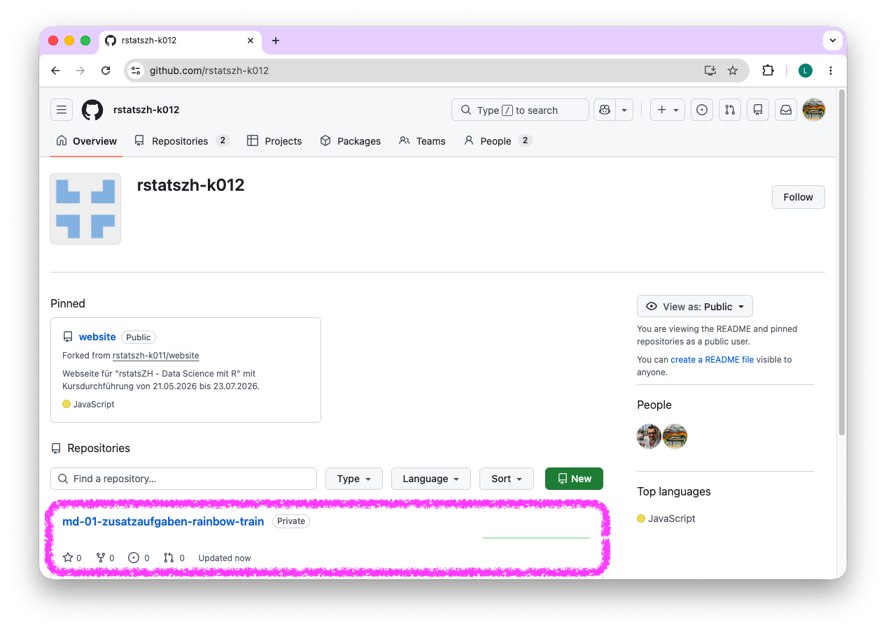
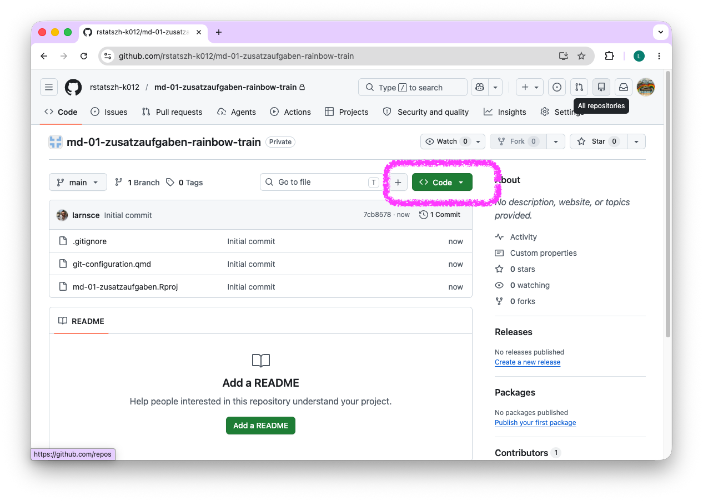
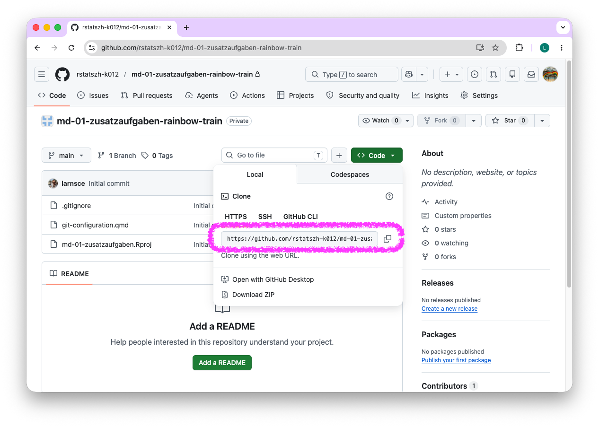
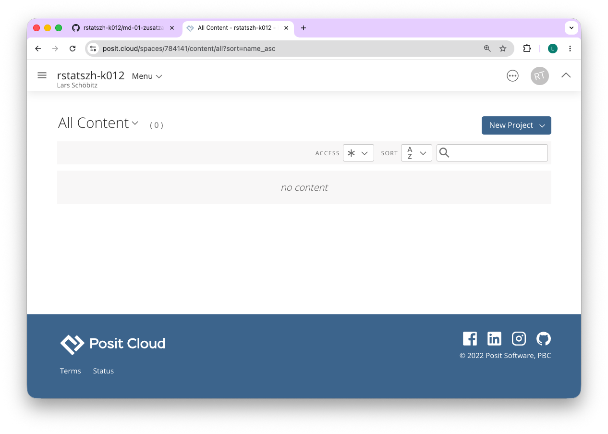
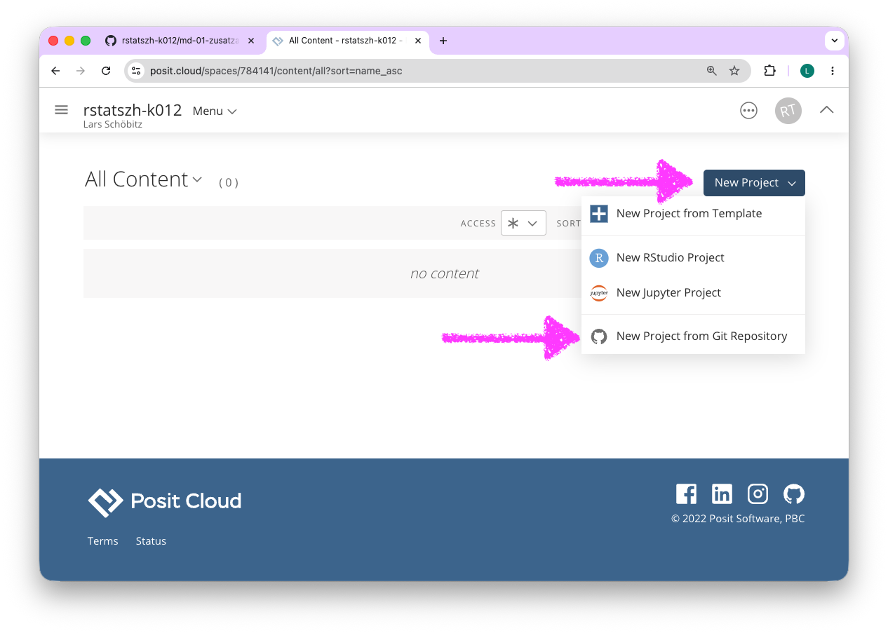
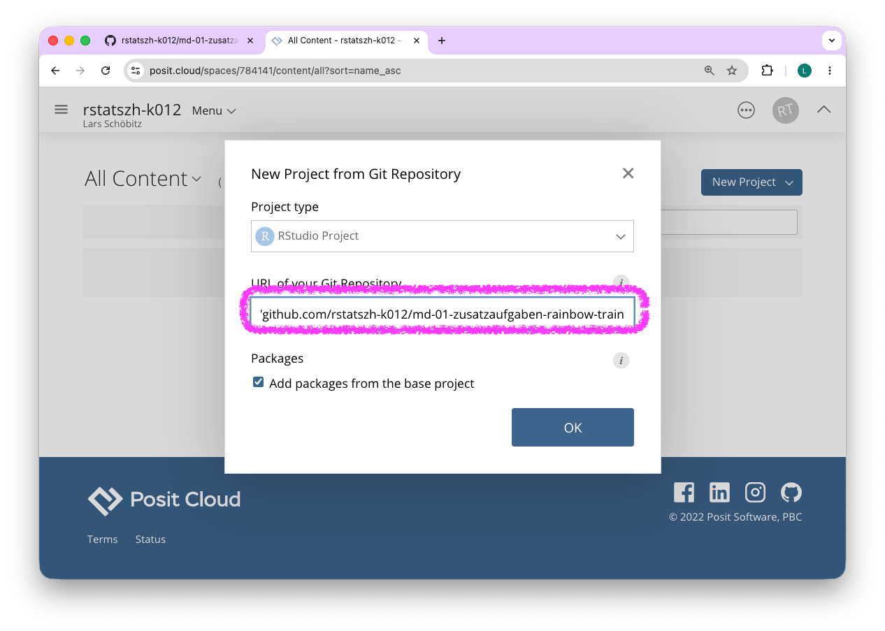
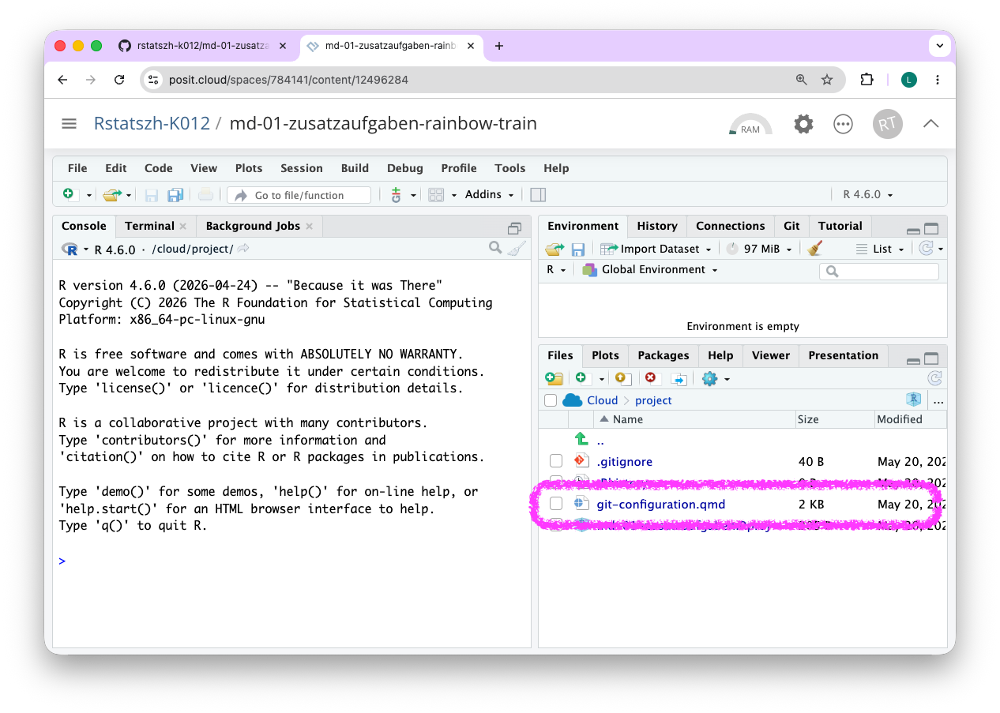
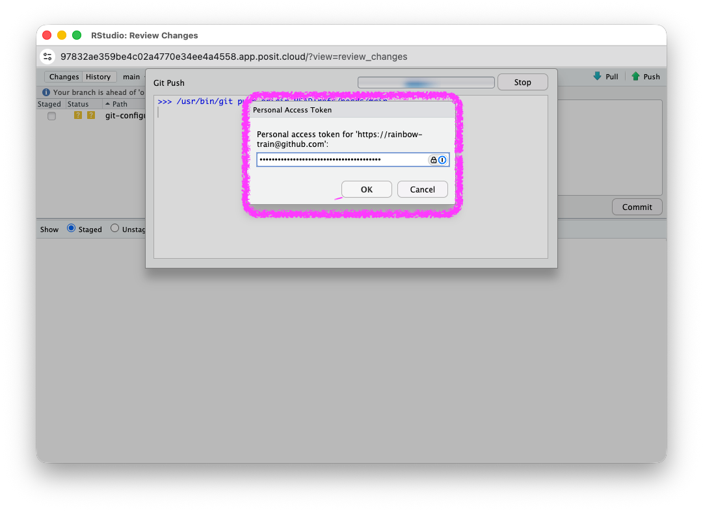
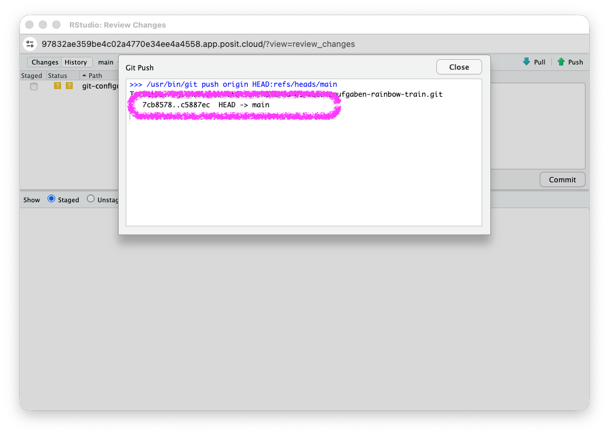

## Schritt 0: Einladung zur GitHub-Organisation annehmen

1. Nehme die Einladung zum Beitritt der GitHub Organisation für den Kurs an.

{width=50%}

## Schritt 1: Klone ein Repository

1. Öffne github.com in deinem Browser.

2. Navigiere zur GitHub-Organisation für den Kurs: []()

{width=50%}

3. Finde das Repository [git-configuration-BENUTZERNAME]{.highlight-yellow}, das mit deinem GitHub-Benutzernamen endet, und öffne es in dem du darauf klickst.

{width=50%}

4. Klicke auf die grüne Schaltfläche "Code".

{width=50%}

5. Kopiere die HTTPS-URL in deine Zwischenablage.

{width=50%}

6. Öffne den  Arbeitsbereich (Workspace) auf [posit.cloud/spaces//join]()

{width=50%}

7. Klicke auf "New Project" > "New Project from Git Repository"

{width=50%}

8. Füge die HTTPS-URL von GitHub in das Feld "URL of your Git Repository" ein. [**Beachte:**]{.highlight-yellow} Stelle sicher, dass die Box unter Packages ein Häkchen gesetzt hat.

{width=50%}

9. Warte, bis das Projekt bereitgestellt wurde.

{width=50%}

10. Fahre mit dem nächsten Schritt 2 fort.

## Schritt 2: Stelle dich Git vor

1. Falls das Projekt aus Schritt 1 geschlossen wurde, öffne das Projekt git-configuration-BENUTZERNAME in Posit Cloud, das mit deinem GitHub-Benutzernamen endet.

2. Öffne die Datei git-configuration.qmd, welche du im Datei Manager ("Files") im Fenster unten rechts findest. Die Datei öffnet sich im Fenster oben rechts.

{width=50%}

3. Bearbeite den Code-Abschnitt unter "Git configuration details" und ersetze die Platzhalter durch deinen Namen und deine E-Mail-Adresse (anhand dieser Daten wird Git dich identifizieren, wenn du Änderungen vornimmst und diese gespeichert werden). **Beachte:** Die Anführungszeichen müssen beibehalten werden.

{width=50%}

4. Render das Dokument in dem du auf den "Render" Button klickst.

{width=50%}

5. Behalte das Projekt git-configuration-BENUTZERNAME in RStudio geöffnet. Fahre mit Schritt 3 fort.

## Schritt 3: Übertrage deine Änderungen und speichere sie

1. Navigiere zum Git-Bereich im Fenster oben rechts.

2. Aktiviere das Kontrollkästchen neben der Datei git-configuration.qmd, um sie für den Commit vorzubereiten.

{width=50%}

3. Klicke auf die Schaltfläche "Commit".

{width=50%}

4. Gib eine Commit-Nachricht in das Feld "Commit Message" ein (z.B. Git configuration abgeschlossen).

{width=50%}

5. Klicke auf die Schaltfläche "Commit". Klicke auf die Schaltfläche “Commit”. Das Fenster, welches sich daraufhin öffnet kann geschlossen werden.

{width=50%}

6. Klicke auf die Schaltfläche "Push".

{width=50%}

7. Gib deinen GitHub-Benutzernamen im Feld Username an. 

{width=50%}

8. Gib [deinen GitHub Personal Access Token (PAT)]{.highlight-yellow} ein.

{width=50%}

9. Das Fenster kann geschlossen werden.

{width=50%}

::: callout-important
## Verwende nicht dein GitHub-Passwort

Du musst GitHub Personal Access Token (PAT) eingeben, den du in der Vorbereitung auf den Kurs erstellt hast um deine Änderungen zurück an GitHub zu übertragen.
:::

## Schritt 4: Eröffne ein Issue auf GitHub

1. Öffne [github.com](https://github.com/) in deinem Browser.

2. Navigiere zur GitHub-Organisation für den Kurs: []()

3. Finde das Repository git-configuration-BENUTZERNAME, das mit deinem GitHub-Benutzernamen endet.

4. Klicke auf die Schaltfläche "Issues".

5. Klicke auf die grüne Schaltfläche "New issue".

6. Schreibe in das Feld "Title": "Git configuration abgeschlossen".

7. Markiere im Feld "Add a description" den Kursleiter mit @larnsce und hinterlasse eine Nachricht oder offene Frage.
